# Python API Homework - What's the Weather Like?

## Background

Whether financial, political, or social -- data's true power lies in its ability to answer questions definitively. So let's take what you've learned about Python requests, APIs, and JSON traversals to answer a fundamental question: "What's the weather like as we approach the equator?"

Now, we know what you may be thinking: _"Duh. It gets hotter..."_

But, if pressed, how would you **prove** it?

## Part I - WeatherPy

In this example, you'll be creating a Python script to visualize the weather of 500+ cities across the world of varying distance from the equator. To accomplish this, you'll be utilizing a [simple Python library](https://pypi.python.org/pypi/citipy), the [OpenWeatherMap API](https://openweathermap.org/api), and a little common sense to create a representative model of weather across world cities.

The first requirement is to create a series of scatter plots to showcase the following relationships:

* Temperature (F) vs. Latitude (Figure 1)
Figure 1 (Latitude vs. Temperature Plot) is displaying the relationship between latitude and temperature across 550 cities. The correlation between latitude and temperature is strong, but not linear.
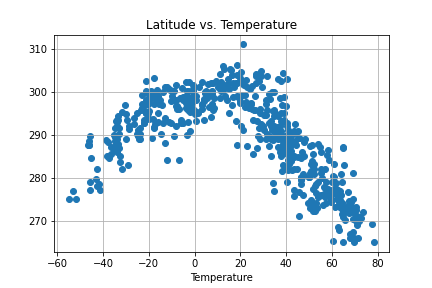

* Humidity (%) vs. Latitude (Figure 2)
Figure 2 (Latitude vs. Humdity Plot) shows no relationshsip between latitude and humditiy.
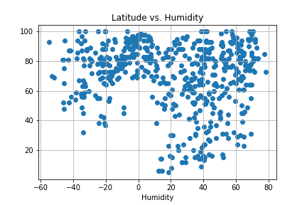

* Cloudiness (%) vs. Latitude (Figure 3)
Figure 3 (Latitude vs. Cloudiness) shows no correlation between latitude and cloudiness across the 550 cities.
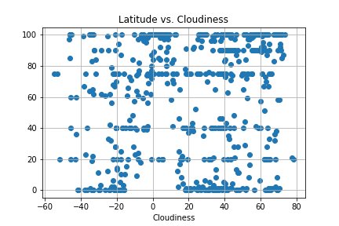

* Wind Speed (mph) vs. Latitude (Figure 4)
Figure 4 (Latitude vs. Wind Speed) shows no correlation between latitude and wind speed.
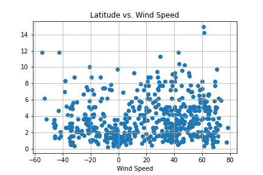

The second requirement is to run linear regression on each relationship. This time, separate the plots into Northern Hemisphere (greater than or equal to 0 degrees latitude) and Southern Hemisphere (less than 0 degrees latitude):

#### Comparsion by Hempshire
* Northern Hemisphere - Temperature (F) vs. Latitude (Figure 5)
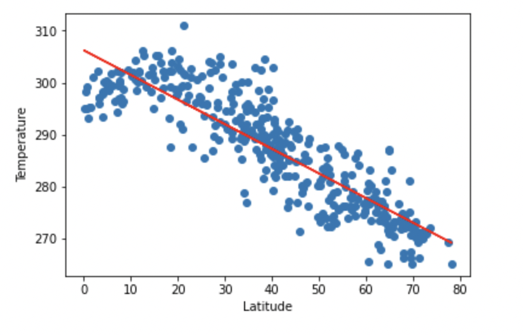

* Southern Hemisphere - Temperature (F) vs. Latitude (Figure 6)
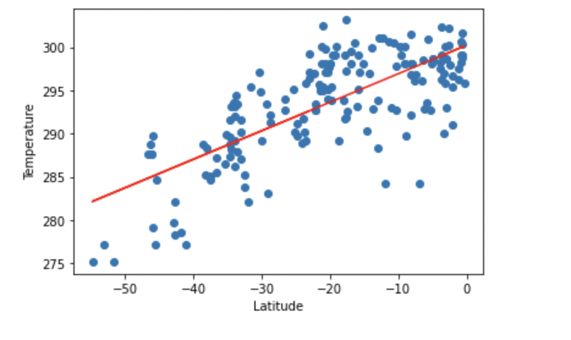

Figure 5 (Northern Hemisphere - Temperature v. Latitude) and Figure 6 (Southern Hemisphere - Temperature v. Latitude) display correlations between temperature and latitude. Figure 6 shows a positive correlation where as Figure 5 shows a negative correlation. As the latitude of a city moves closer to the equator, we see temperature increase, and as the latitude of a city moves away from the equator we see temperature decrease.

* Northern Hemisphere - Humidity (%) vs. Latitude (Figure 7)
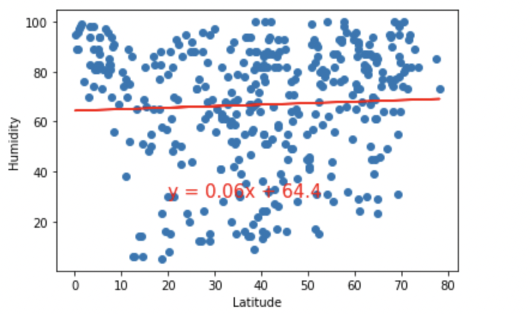

* Southern Hemisphere - Humidity (%) vs. Latitude (Figure 8)
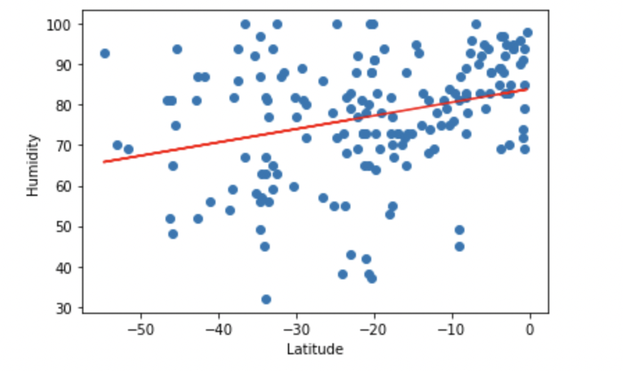

Figures 7 (Northern Hempisphere) and 8 (Southern Hempishere) display the relatoinship between humidity and latitude across 550 cities. While Figure 7 displays no correlation between humditity and latitude, Figure 8 displays a moderate correaltion between humditiy and latitude.

* Northern Hemisphere - Cloudiness (%) vs. Latitude (Figure 9)
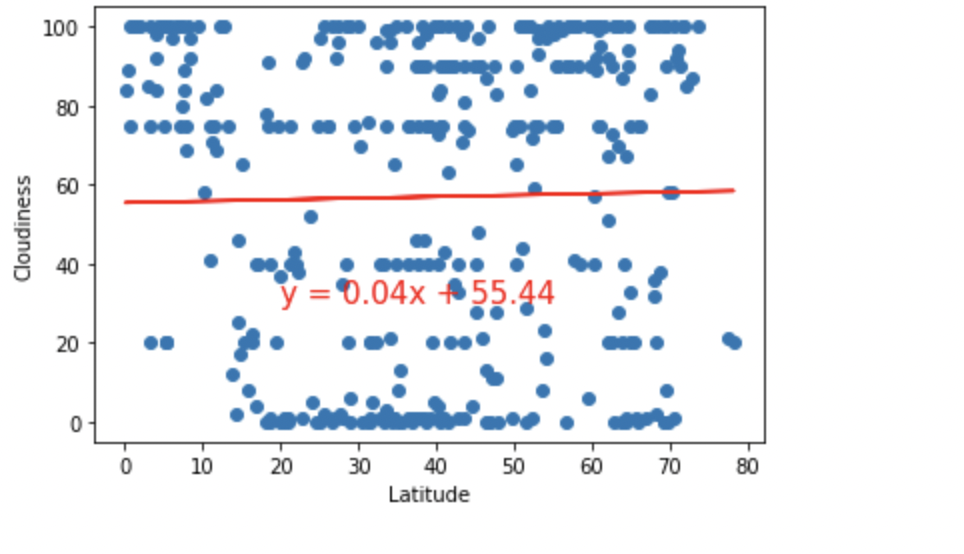

* Southern Hemisphere - Cloudiness (%) vs. Latitude (Figure 10)
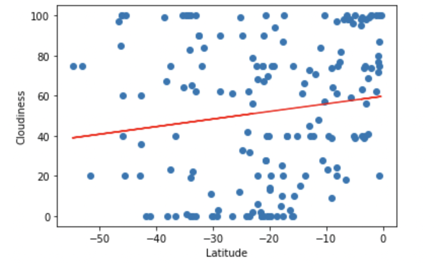

Figures 9 (Northern Hemisphere) and 10 (Southern Hemisphere) display the relationship between cloudiness and latitude. Niether figure 9 or 10 display a coreelation between the illustrated data points.

* Northern Hemisphere - Wind Speed (mph) vs. Latitude (Figure 11)
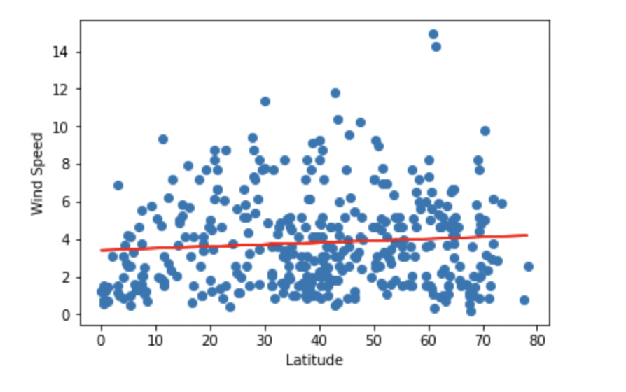

* Southern Hemisphere - Wind Speed (mph) vs. Latitude
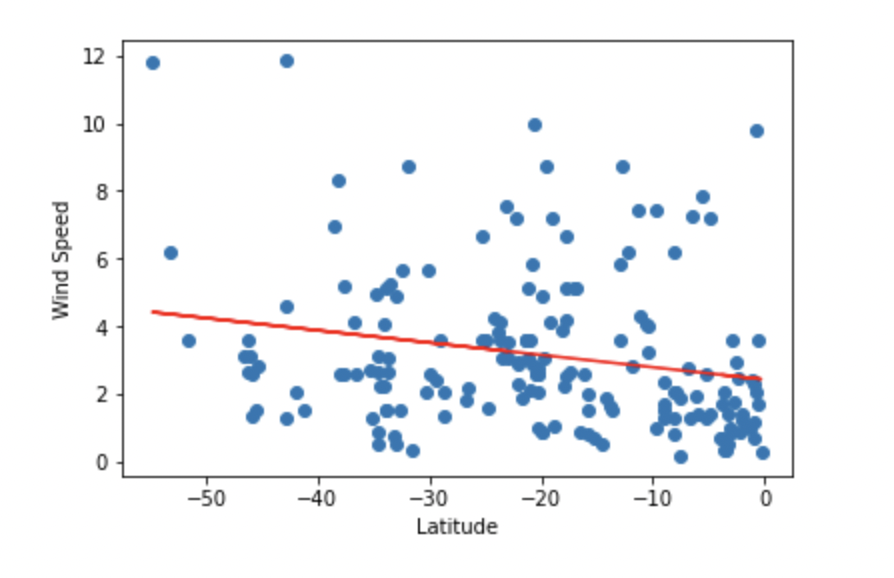 (Figure 12)

Figures 11 and 12 display the relationship between wind speed and latitude. Figure 12 displays a weak negative correlation between wind speed and latitude; whereas, Figure 11 shows no relationship between wind speed and latitude in the northern hemisphere.

---

### Part II - VacationPy

Now let's use your skills in working with weather data to plan future vacations. Use jupyter-gmaps and the Google Places API for this part of the assignment.

* Create a heat map that displays the humidity for every city from Part I.

  

* Plot the hotels on top of the humidity heatmap with each pin containing the **Hotel Name**, **City**, and **Country**.

  

- - -

© 2021 Trilogy Education Services, LLC, a 2U, Inc. brand. Confidential and Proprietary. All Rights Reserved.
